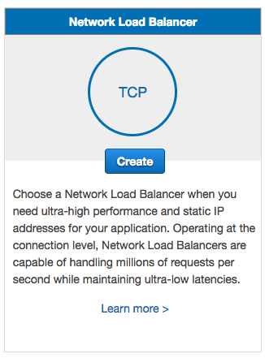
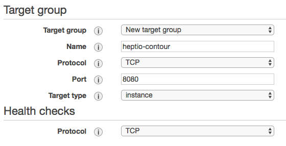

# Heptio Contour Deployment on AWS with NLB

This is an advanced deployment guide to configure Contour on AWS with the [Network Load Balancer (NLB)[1].
This configuration has several advantages:

1. NLBs are often cheaper. This is especially true for development. Idle LBs do not cost money.
2. There are no extra network hops. Traffic goes to the NLB, to the node hosting Contour, and then to the target pod.
3. Source IP addresses are retained. Envoy (running as part of Contour) sees the native source IP address and records this with an `X-Forwarded-For` header.

## Moving parts

- We run Contour as a DaemonSet across the cluster.
- The Contour pod runs with host networking and binds to port 8080 on the node.
- Host networking means that traffic hits Envoy without transitioning through any other fancy networking hops.
- Contour also binds to 8000 and 8001 for Envoy->Contour config traffic.

We then set up an NLB to point to all of the nodes that Contour is running on.
This [cannot be done currently through Kubernetes][3].
The AWS cloud provider only knows how to create classic ELBs.

This page describes how to set up the NLB in the AWS console, but you can automate with CloudFormation or Terraform, or by scripting the AWS CLI.

## Deploying Contour

1. [Clone the Contour repository][4] and cd into the repo.
2. Run `kubectl apply -f deployment/ds-hostnet/`

If you have a cluster without RBAC then skip applying the `02-rbac.yaml` file.

This creates the `heptio-contour` Namespace along with a ServiceAccount, RBAC rules, and the DaemonSet itself.
No Service object is created.

## Create and Configure an AWS NLB

1. In the AWS console, go to **EC2 > Load Balancers** and select **Create Load Balancer**.
2. Create a TCP Network Load Balancer:

### Configure Load Balancer

- Provide the required information to configure the load balancer, then select **Next: Configure Routing**.
  - Consider basing the name and any tags on the cluster that the load balancer points to (here, `heptio-contour`).
  - Accept the default values except for the Availability Zone.
  - For Availability Zones, select the correct VPC and a *public* subnet for each zone.

### Routing

- Provide the required information to configure routing, then select **Next: Register Targets**.
  - Create a new target group (here the same as the load balancer name, `heptio-contour`).
  - Change the port to `8080`.

### Register Targets

- Provide the required information to register targets, then select **Next: Review**.
  - You can explicitly list the target VMs. Or if you have set up an Auto Scaling group, you can configure it to populate the target group.

### Review and Create

- Review the information you provided, make any necessary changes, then select **Create**.

## (optional) Configure Auto Scaling Group

If you set up an Auto Scaling group to manage the nodes in your cluster, you can configure the ASG to register its members with the target group.

1. Go to **EC2 > Auto Scaling**, select the ASG for your nodes, and select **Edit**.
2. Set Target Groups to the target group that you defined for the Network Load Balancer, and select **Save**.
3. On the **Details** tab of **Target Groups**, confirm that the targets are appropriately set.

### Adjust Security Groups

You will probably need to adjust your security groups so that your new load balancer can reach your VMs.

1. Go to **EC2 > Security Groups**, select the group for your nodes, select the **Inbound** tab, and select **Edit**.
2. Add a new rule to allow inbound traffic on port 8080 from Anywhere.

# Test

You can now test your NLB.

1. Install a workload (see the kuard example in the [main deployment guide][2]).
2. Look up the address for your NLB in the AWS console and enter it in your browser.
  - Notice that Envoy fills out `X-Forwarded-For`, because it was the first to see the traffic directly from the browser.

[1]: https://aws.amazon.com/blogs/aws/new-network-load-balancer-effortless-scaling-to-millions-of-requests-per-second/
[2]: deploy-options.md#test
[3]: https://github.com/kubernetes/kubernetes/issues/52173
[4]: ../CONTRIBUTING.md